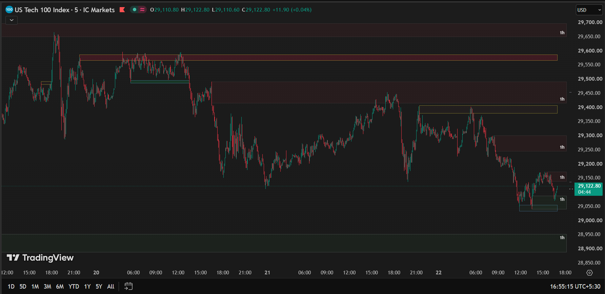

# Adaptive Support & Resistance and Supply-Demand Zone Engine

An institutional-style **support/resistance and supply/demand zone detector** for TradingView, built in Pine Script v6. It combines pivot-based structure detection, volume- and momentum-validated zone scoring, higher-timeframe (HTF) confluence, automatic asset-class tuning, and multi-timeframe supply/demand mapping into a single overlay indicator.

On-chart title: `Arpan's Support & Resistance`

## Preview

---

## Table of Contents

- [Overview](#overview)
- [Features](#features)
- [How It Works](#how-it-works)
  - [1. Adaptive Asset Detection](#1-adaptive-asset-detection)
  - [2. Zone Engine & Scoring](#2-zone-engine--scoring)
  - [3. Polarity Flip & Invalidation](#3-polarity-flip--invalidation)
  - [4. Multi-Timeframe Supply & Demand](#4-multi-timeframe-supply--demand)
  - [5. Session Levels](#5-session-levels)
- [Installation](#installation)
- [Configuration](#configuration)
- [Visual Legend](#visual-legend)
- [Limitations & Notes](#limitations--notes)
- [Potential Future Work](#potential-future-work)
- [Disclaimer](#disclaimer)
- [License](#license)

---

## Overview

Most public support/resistance scripts draw a fixed number of pivot lines and leave every symbol and timeframe to fend for itself. This engine instead treats each zone as a **stateful object** that is born, scored, aged, merged, and either invalidated or flipped in polarity as price interacts with it — and it retunes its own sensitivity based on what instrument it's running on.

## Features

- **Object-oriented zone engine** — zones are Pine user-defined types (`zoneObj`) carrying their own price range, age, touch count, volume/HTF bonuses, and reaction strength, rather than raw drawing primitives.
- **Automatic asset-class detection** — parses `syminfo.ticker` to classify the chart as Gold, Silver, Energy, Crypto, Index, Forex, Macro, or Other, then swaps in a tuned decay/momentum/memory preset for that class.
- **Momentum- and volume-validated zone creation** — new zones only form after a minimum count of strong-bodied candles and either a volume spike or a displacement move, filtering out noise pivots.
- **Weighted strength scoring** — zones are scored from touches, volume bonus, HTF confluence, and reaction magnitude, and classified as *Elite* or *Strong*; weak/aged zones are pruned automatically.
- **Polarity flip (SMC-style)** — a validly broken support zone flips into resistance (and vice versa) instead of just disappearing, provided the break is confirmed by a volume surge or HTF pivot.
- **Multi-timeframe supply & demand zones** — detects imbalance candles on 30m/1h/4h/Daily/Weekly timeframes via `request.security`, merges overlapping zones, and invalidates them live as price closes through.
- **Previous day/week high-low levels** — auto-updating PDH/PDL/PWH/PWL reference lines.
- **Configurable rendering** — boxes or midlines, optional price-range labels, adjustable colors per zone type and strength tier.

## How It Works

### 1. Adaptive Asset Detection

The script upper-cases `syminfo.ticker` and pattern-matches it against curated substrings to bucket the instrument into one of seven classes (priority-ordered so, e.g., `BTCUSD` resolves to Crypto and not Forex). When **Auto-Tune Asset Matrix** is enabled, each class maps to its own preset for decay speed, momentum-body multiplier, and max pivot memory:

| Asset Class | Decay (bars) | Momentum Mult. | Pivot Memory |
|---|---|---|---|
| Gold | 600 | 0.50 | 8 |
| Silver | 650 | 0.45 | 8 |
| Crypto | 500 | 0.50 | 8 |
| Forex | 900 | 0.40 | 10 |
| Index | 700 | 0.45 | 10 |
| Energy | 800 | 0.45 | 10 |
| Macro / Other | 700 | 0.50 | 10 |

Faster-moving assets (crypto, gold) get shorter decay and looser momentum requirements; slower assets (forex, indices) get longer memory and stricter confirmation.

### 2. Zone Engine & Scoring

On each confirmed pivot high/low, the script either merges the new level into an existing nearby zone or — if it clears adaptive spacing and momentum filters — creates a new `zoneObj`. If the tracked-zone array is full, the weakest zone is evicted first, with zones carrying HTF confluence protected from eviction.

Each active zone accumulates a score:

- **Simple mode:** `touches + volume bonus + HTF bonus + reaction bonus`
- **Weighted mode (default):** `touches×2 + volume bonus + HTF bonus×2 + reaction bonus×2`

Zones scoring above the *Elite* or *Strong* thresholds are drawn; everything else stays invisible noise. Every zone's effective strength also decays over time (`age ÷ Decay Factor`), so a zone that stops getting confirmed eventually ages out even without breaking.

### 3. Polarity Flip & Invalidation

A zone is considered broken when price closes (or wicks, depending on the **Zone Invalidation** setting) through it. A break only counts as *valid* if it isn't a rejection wick **and** is backed by a volume surge or existing HTF confluence — otherwise the zone survives as noise-filtered. On a valid break with **Flip Zones on Break** enabled, the zone's polarity inverts (old support becomes new resistance) and its stats reset; without a valid break, the zone is deleted, or retired as a faded historical mark if it was Elite-tier.

### 4. Multi-Timeframe Supply & Demand

Independently of the pivot engine, `createSupplyDemandZones()` pulls higher-timeframe OHLC via `request.security` and flags imbalance candles — a strong directional candle following an opposite/neutral one, scaled past **Zone Difference Scale** — as supply or demand boxes. Overlapping boxes across calls are merged, and each box is deleted in real time once price closes through it.

### 5. Session Levels

Previous day/week high and low are fetched with `request.security` and rendered as extending reference lines with price labels, refreshed only on the most recent bar for performance.

## Installation

1. Open any chart on [TradingView](https://www.tradingview.com/).
2. Open **Pine Editor** (bottom panel).
3. Create a new blank indicator and paste in the contents of the `.pine` script from this repository.
4. Click **Add to Chart**.
5. Open the indicator's **Settings** to adjust inputs (see [Configuration](#configuration)).

## Configuration

<strong>Core Upgrades & Performance</strong>

| Input | Default | Description |
|---|---|---|
| Lookback Limit | 2000 | Restricts calculation to the most recent N bars for performance |
| Draw Mode | Boxes | Render zones as filled boxes or as midlines |
| Zone Invalidation | Close | Break zones on candle close vs. intrabar wick |
| Use HTF Pivots | On | Confirms pivots against a higher timeframe |
| Higher Timeframe | 240 (4h) | Timeframe used for HTF pivot confirmation |
| Auto-Tune Asset Matrix | On | Dynamically retunes decay/momentum/memory per detected asset class |

<strong>Institutional Engine</strong>

| Input | Default | Description |
|---|---|---|
| Momentum Body Mult | 0.5 | Candle-body multiplier required to count as a "strong" candle |
| Momentum Count | 2 | Minimum momentum candles needed to validate a new zone |
| Max Zone Size (ATR) | 1.8 | Caps zone height as a multiple of ATR |
| Merge Overlapping Zones | On | Merges intersecting zones into one stronger zone |
| Min Zone Duration (Bars) | 5 | Hides zones younger than this many bars |
| Zone Merge Dist (ATR) | 0.3 | Distance (in ATR) within which nearby zones merge |
| Decay Factor (Bars) | 800 | Bars over which a zone's score decays by 1 |

<strong>Pivot Zones (Support & Resistance)</strong>

| Input | Default | Description |
|---|---|---|
| Look Left / Look Right | 12 / 12 | Bars checked left/right for pivot confirmation |
| Max Pivot Memory | 10 | Max active zones tracked per side |
| ATR Length | 20 | Lookback for zone-sizing ATR |
| Zone Width (ATR) | 0.5 | Zone half-width as a multiple of ATR |
| Max Zone Percent | 4 | Caps zone width as a % of price |
| Source For Pivots | High/Low | HA, High/Low Body, or High/Low |
| Extend Right | Off | Extend zones to the chart's right edge |
| Show Level Labels | Off | Prints the price range beside each zone |
| Flip Zones on Break (Polarity) | On | Converts broken support into resistance and vice versa |
| Show Elite Broken Zones | On | Preserves high-scoring zones as faded history after they break |

<strong>Supply & Demand Zones</strong>

| Input | Default | Description |
|---|---|---|
| Zone Difference Scale | 1.8 | Minimum candle-range expansion to flag a supply/demand candle |
| Zone Extension (Bars) | 15 | How far zones extend to the right |
| Enable Supply / Demand | On / On | Toggle each zone type independently |
| Display S&D Text | On | Shows the source timeframe label on each zone |

<strong>Supply & Demand Timeframes</strong>

| Input | Default |
|---|---|
| Show Forming Zones | Off |
| 30m | Off |
| 1h | On |
| 4h | On |
| Daily | Off |
| Weekly | Off |

<strong>Detection & Volume Filter</strong>

| Input | Default | Description |
|---|---|---|
| Detect Pivot Highs / Lows | On / On | Enable each pivot side independently |
| Volume SMA Length | 20 | Baseline volume average length |
| Volume Surge Threshold (%) | 20.0 | Minimum 5/10 EMA volume oscillator reading to confirm a breakout |

<strong>Zone Strength</strong>

| Input | Default | Description |
|---|---|---|
| Use Scalping Scoring | Off | Switches between fast/reactive scoring and accuracy-weighted scoring |

## Visual Legend

| Element | Meaning |
|---|---|
| 🟩 Dark green box | Elite-tier demand/support zone |
| 🟩 Light green box | Strong-tier demand/support zone |
| 🟥 Dark red box | Elite-tier supply/resistance zone |
| 🟥 Light red box | Strong-tier supply/resistance zone |
| Translucent green fill | Multi-timeframe demand zone |
| Translucent red fill | Multi-timeframe supply zone |
| Gray dashed line | Previous day high/low |
| White dotted line | Previous week high/low |

## Limitations & Notes

- Pivot-based zones confirm `right` bars after the actual pivot — an inherent lag of any repaint-safe pivot detector, not a bug.
- This is a **visual indicator only** — it does not include `alertcondition()` alerts or `strategy()`-based backtesting.
- Multi-timeframe supply/demand data is pulled via `request.security`; results are only as reliable as TradingView's HTF data feed for the symbol in question.
- Requires TradingView (Pine Script v6) — not portable to other charting platforms without a rewrite.

## Potential Future Work

*(Ideas only — not implemented in the current version)*

- Native `alertcondition()` triggers for zone formation, touch, and break events
- Cross-timeframe confluence scoring between the pivot engine and the S&D engine
- A companion `strategy()` version for backtesting zone-reaction entries

## Disclaimer

This project is a technical/charting tool for educational purposes and is **not financial advice**. Past zone reactions do not guarantee future price behavior. Always backtest and use independent risk management before trading with any indicator.

## License

No license is currently specified, so default copyright applies (all rights reserved). If you intend to share or accept contributions, consider adding an [MIT License](https://choosealicense.com/licenses/mit/) — a common permissive choice for TradingView community scripts.

---

Built by **Arpan** · Pine Script v6 · TradingView
