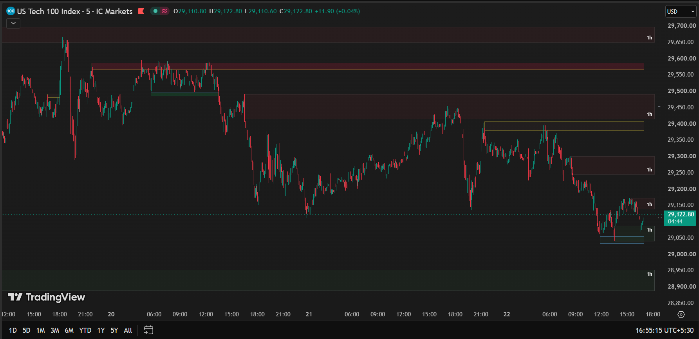
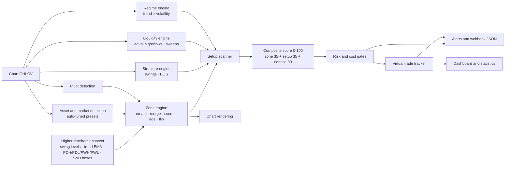
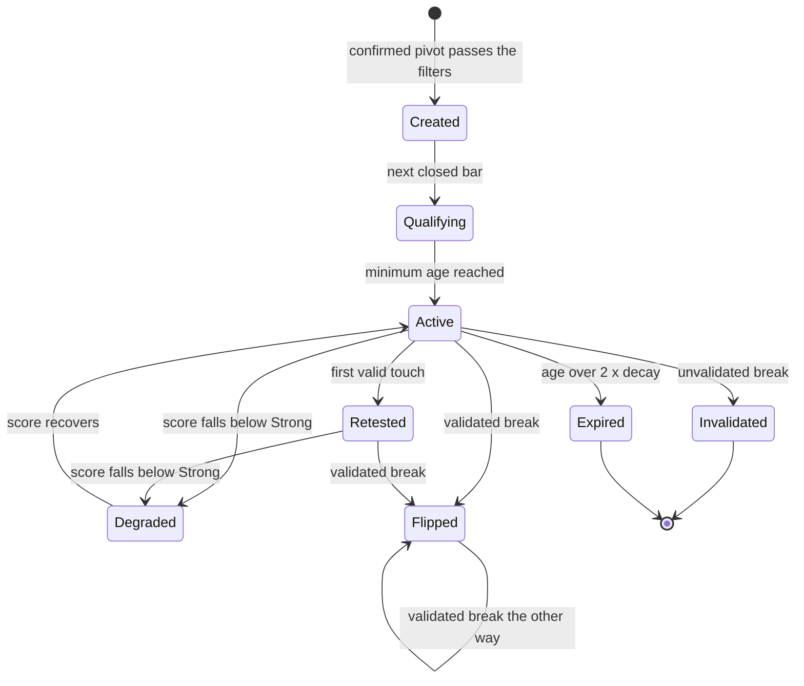
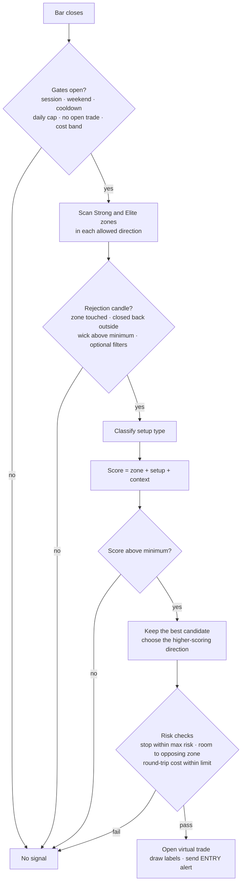

<div align="center">

# ASR Engine v3

### Adaptive Support & Resistance · Supply & Demand · Signal Engine for TradingView

A non-repainting **Pine Script v6** indicator that turns price action into *stateful* zones, reads market structure, liquidity and regime, scores every trade setup from 0 to 100, models risk and trading costs, and emits webhook-ready alerts.


</div>



> **On-chart name:** `ASRv3` (full title *Arpan's S&R + Signal Engine*) · **Language:** Pine Script v6 · **Type:** overlay indicator · **Alert schema:** v3

---

## Table of Contents

- [Overview](#overview)
- [Key Features](#key-features)
- [Architecture](#architecture)
- [Quick Start](#quick-start)
- [How It Works](#how-it-works)
  - [Asset and Market Detection](#asset-and-market-detection)
  - [Zone Engine](#zone-engine)
  - [Market Structure Engine](#market-structure-engine)
  - [Liquidity Engine](#liquidity-engine)
  - [Regime Engine](#regime-engine)
  - [Higher-Timeframe Context](#higher-timeframe-context)
  - [Multi-Timeframe Supply and Demand](#multi-timeframe-supply-and-demand)
  - [Signal Engine](#signal-engine)
  - [Risk Model and Virtual Trades](#risk-model-and-virtual-trades)
  - [Dashboard](#dashboard)
- [Configuration Reference](#configuration-reference)
- [Alerts and Webhook Integration](#alerts-and-webhook-integration)
- [Visual Legend](#visual-legend)
- [Non-Repainting and Data Integrity](#non-repainting-and-data-integrity)
- [Performance and Limits](#performance-and-limits)
- [Troubleshooting and FAQ](#troubleshooting-and-faq)
- [Known Limitations](#known-limitations)
- [Roadmap](#roadmap)
- [Changelog](#changelog)
- [Contributing](#contributing)
- [Glossary](#glossary)
- [Disclaimer](#disclaimer)
- [License](#license)

---

## Overview

ASR Engine is built on one idea: **a support or resistance level is not a line — it is an object with a life-cycle.** Every zone is born from a confirmed pivot, filtered for quality, scored, aged, touched, tested, and finally invalidated, expired, or *flipped* into the opposite polarity. A signal engine then watches the best zones for rejection setups, scores each setup in three parts (zone quality, setup quality, market context), checks it against a risk and cost model, and reports the result on an on-chart dashboard and through versioned, machine-readable alerts.

| Layer | Question it answers |
|---|---|
| **Zone engine** | Which levels actually mattered, and how strong are they *now*? |
| **Structure · liquidity · regime engines** | Is the market trending or ranging? Has liquidity just been swept? Is volatility high or low? |
| **Signal engine** | Is there a high-quality rejection at one of those zones on this bar? |
| **Risk and cost model** | Does the trade have a sane stop, enough room to run, and costs small enough to matter? |
| **Virtual trade tracker** | If every signal had been taken exactly by the rules, how would it have played out, measured in R? |
| **Alert layer** | How do I get the signal into a bot, a chat channel or an execution service with a stable JSON contract? |

### Who it is for

- **Discretionary traders** who want objective, self-maintaining zones with strength labels instead of hand-drawn lines.
- **Systematic and automation-minded traders** who need a documented, versioned alert payload and explicit cost gates.
- **Researchers and students** who want a transparent signal pipeline in which every score component is visible.

### What it is not

- It is an `indicator()`, **not** a `strategy()`. It does not use TradingView's Strategy Tester and it does not place orders. The performance figures on the dashboard come from an internal *virtual trade tracker* (see [Risk Model and Virtual Trades](#risk-model-and-virtual-trades)).
- It does not predict price and does not promise profitability. See the [Disclaimer](#disclaimer).
- Features marked **TEST** in the settings are experimental and may change.

### Where it fits

ASR Engine is the TradingView layer of a systematic-trading workflow: Pine Script is used for development, charting, research and manual inspection, while a Python implementation of the same rules is intended to be the canonical engine for full-history processing, backtesting and automated execution (the *Lookback Limit* setting exists purely as a Pine performance gate). The webhook alerts documented below are an optional bridge into such a system. They need a paid TradingView plan, whereas the indicator itself runs on any plan.

---

## Key Features

**Zone engine**

- **Stateful zones** — every zone is a typed object carrying its price range, age, touches, reaction, confluence flags, tier and life-cycle status.
- **Eight-state life-cycle** — Created → Qualifying → Active → Retested → Degraded → Flipped → Invalidated → Expired.
- **Quality score (0–35)** — displacement, qualified touches, post-touch reaction, higher-timeframe / multi-timeframe / previous-day-week confluence and volume, decayed by freshness. Zones are classified **Strong** or **Elite**.
- **Polarity flip** — a validated break turns support into resistance (and vice versa), scored only on evidence the break actually produced.
- **Failed-break memory** — in *Wick* invalidation mode, a wick that pierces a zone but closes back inside is logged as a failed break and the zone survives.
- **Elite history** — high-quality zones that break or expire can stay on the chart as faded history, capped to protect drawing limits.

**Context engines**

- **Market structure** — confirmed swings, BOS↑ / BOS↓ events and an UP / DOWN / RANGE state.
- **Liquidity** — equal highs/lows and sweep detection (SW↑ / SW↓).
- **Regime** — higher-timeframe EMA trend (↑ / ↓ / RANGE) combined with ATR-percentile volatility (High / Normal / Low).
- **Confluence sources** — higher-timeframe swing levels, 30m–Weekly supply/demand boxes, and previous day/week high/low.

**Signal engine**

- **Four implemented setup types** — `ZONE_REJECT`, `FLIP_RETEST`, `SWEEP_RECLAIM`, `BOS_RETEST` (plus `DISPLACEMENT_RETEST`, reserved).
- **Composite score 0–100** = zone quality (0–35) + setup quality (0–35) + market context (0–30), graded A / B / C.
- **Discipline filters** — session window, weekend skip, cooldown, per-zone and per-day caps, optional HTF trend gating, optional candle-direction and volume requirements.

**Risk, cost and accounting**

- ATR-based stop, risk cap, room-to-target check, TP1 / TP2 partials, break-even, trailing runner and time stop.
- **Cost-aware gating** — fees and slippage are converted into R; trades whose round-trip cost exceeds the limit are skipped.
- **Virtual trade tracker** with separate WIN / LOSS / BREAK-EVEN accounting, expectancy, profit factor, max drawdown, loss streak and a low-sample warning.

**Automation**

- **Versioned JSON alerts (schema v3)** — `ENTRY`, `EXIT` and `HEARTBEAT` events with passphrase, time-to-live, idempotent event IDs and a model-ready `features` object.
- **Plain `alertcondition()` alerts** for push, e-mail or chat notifications.

**Usability**

- Automatic asset-class and market-type detection with manual overrides.
- 13 numbered settings groups, an on-chart dashboard, trade boxes, and structure / liquidity labels.

---

## Architecture

### Pipeline


```mermaid
flowchart LR
    HTF["Higher-timeframe context<br/>swing levels · trend EMA · PDH/PDL/PWH/PWL · S&D boxes"] --> ZONE["Zone engine<br/>create · merge · score · age · flip"]
    OHLCV["Chart OHLCV"] --> DET["Asset and market detection<br/>auto-tuned presets"]
    DET --> ZONE
    OHLCV --> PIV["Pivot detection"]
    PIV --> ZONE
    OHLCV --> STR["Structure engine<br/>swings · BOS"]
    OHLCV --> LIQ["Liquidity engine<br/>equal highs/lows · sweeps"]
    OHLCV --> REG["Regime engine<br/>trend × volatility"]
    ZONE --> SCAN["Setup scanner"]
    STR --> SCAN
    LIQ --> SCAN
    REG --> SCAN
    SCAN --> SCORE["Composite score 0-100<br/>zone 35 + setup 35 + context 30"]
    SCORE --> GATES["Risk and cost gates"]
    GATES --> VT["Virtual trade tracker"]
    GATES --> ALERT["Alerts and webhook JSON"]
    VT --> ALERT
    VT --> DASH["Dashboard and statistics"]
    ZONE --> DRAW["Chart rendering"]
```

### What happens on every closed bar

State changes only on **confirmed (closed) bars**. In order, the script:

1. Updates ATR, volume state, regime and higher-timeframe context.
2. Updates market-structure and liquidity state.
3. Creates new zones from newly confirmed pivots and merges overlaps.
4. Processes every zone: life-cycle, touches, reaction, scoring, breaks, flips and drawing.
5. Updates the multi-timeframe supply/demand boxes.
6. Manages the open virtual trade (stop, targets, trailing stop, time stop).
7. Scans for a new signal if no trade is open and every gate is open.
8. Emits alerts (**`EXIT` before `ENTRY`** when both occur on one bar) and refreshes the dashboard on the last bar.

### Design decisions

| Decision | Rationale |
|---|---|
| Zones are born at pivot **confirmation**, not at the pivot bar | No look-ahead: what you see on history is what you would have seen live. |
| Higher-timeframe data is requested with a `[1]` offset and `lookahead_on` | The standard non-repainting pattern. |
| The stop is assumed to be hit **before** targets on the same bar | Conservative intrabar ordering avoids optimistic bias. |
| Break-even and time exits are reported separately from wins and losses | Prevents win-rate inflation and keeps expectancy honest. |
| Costs are converted into R **before** a signal fires | At small stop distances, fees and slippage can consume a large share of 1R. |
| One virtual trade at a time | Keeps statistics unambiguous and avoids overlapping-trade double counting. |
| Alert payloads are versioned and carry score components | Receivers can log, audit and analyse signals, and future schema changes stay backward-compatible. |
| Metrics emphasise expectancy, drawdown and sample size | Win rate alone is a misleading measure of quality. |

---

## Quick Start

### Requirements

- A [TradingView](https://www.tradingview.com/) account. The indicator runs on any plan. **Webhook delivery** (optional) needs a paid plan (Essential or higher), and TradingView also requires two-factor authentication on the account.
- A chart with **standard candlesticks**. Non-standard chart types (Heikin Ashi, Renko, Kagi, Line Break, Range, Point & Figure) transform OHLC values and are not supported.
- A symbol with OHLC data. Volume is optional: without it, volume filters switch themselves off and the dashboard says so.

### Installation

1. Open any chart on TradingView.
2. Open the **Pine Editor** (bottom panel) and create a new blank indicator.
3. Paste the contents of the `.pine` file from this repository and click **Save**.
4. Click **Add to chart**.
5. Open the indicator **Settings** and review the inputs (see [Configuration Reference](#configuration-reference)).

### First-run checklist

| Check | Where to look | Healthy result |
|---|---|---|
| Instrument classified correctly | Dashboard → *Asset / Market* | Matches your instrument; otherwise set *Asset Override* / *Market Type Override* |
| Cost gate is open | Dashboard → *Cost Band* | `OK (ATR%=…)`. `EMPTY` means no signal can pass (see [cost model](#cost-model-and-feasibility-band)) |
| Volume available | Dashboard → *Volume Data* | `Available` |
| Zones are appearing | Chart | Boxes labelled `E` / `S` after the first confirmed pivots |
| Webhook configured (optional) | Dashboard → *Webhook* | `passphrase set` |
| Enough trades to read the statistics | Dashboard → *Trades* | 30 or more (the `⚠ low N` warning disappears) |

### Recommended starting point

Start with the defaults. They assume liquid crypto perpetual markets (the fee and slippage defaults reflect typical USDT-margined futures taker costs) on charts from about 15 minutes upward. For any other venue, set **Fee Per Side** and **Slippage Per Side** to your real costs first — the cost gate is only as honest as these two numbers. Then change one settings group at a time and watch the dashboard.

---

## How It Works

### Asset and Market Detection

On load the script classifies the instrument twice: its **asset class**, which selects a tuned preset, and its **market type**, which decides whether shorts are allowed. Both can be overridden in the *Core Engine* settings.

**Asset class** is resolved in this priority order, so `BTCUSD` becomes `CRYPTO` and never `FOREX`:

| Priority | Class | Detected from (examples) |
|---|---|---|
| 1 | `CRYPTO` | Symbol type *crypto*; known crypto roots or base currencies (BTC, ETH, SOL, XRP, BNB, DOGE, ADA, LTC, AVAX, LINK and others, plus CME micro-crypto MBT / MET / MSL / MXP); tickers starting with a major coin |
| 2 | `MACRO` | DXY, VIX, US02Y–US30Y yields, TNX / TYX / FVX / IRX |
| 3 | `GOLD` | `GC`, `MGC`, `QO`, `GOLD`, `XAU…` |
| 4 | `SILVER` | `SI`, `SIL`, `QI`, `XAG…`, and copper (`HG`, `MHG`, `QC`, `XCU`, `COPPER`) |
| 5 | `ENERGY` | `CL`, `MCL`, `QM`, `NG`, `BZ` and similar, plus `USOIL`, `UKOIL`, `WTI`, `BRENT`, `XTI`, `XBR` |
| 6 | `INDEX` | Symbol type *index*; `ES`, `NQ`, `YM`, `RTY`, `FDAX`, `SPX`, `NAS100`, `US30`, `GER40`, `NIFTY`, `SENSEX` and similar |
| 7 | `FOREX` | Symbol type *forex*, CME FX futures (`6E`, `6J`, `6B`, …), or a six-letter pair of recognised currency codes |
| 8 | `OTHER` | Everything else |

**Auto-Tune presets.** With *Auto-Tune Asset Matrix* on, each class replaces three manual inputs:

| Asset class | Decay (bars) | Momentum body mult. | Max zones per side | Min zone spacing (ATR) |
|---|---|---|---|---|
| Crypto | 500 | 0.50 | 8 | 0.30 |
| Gold | 600 | 0.50 | 8 | 0.40 |
| Silver / Copper | 650 | 0.45 | 8 | 0.40 |
| Forex | 900 | 0.40 | 10 | 0.50 |
| Index | 700 | 0.45 | 10 | 0.40 |
| Energy | 800 | 0.45 | 10 | 0.40 |
| Macro / Other | 700 | 0.50 | 10 | 0.40 |

Faster-moving assets get shorter memory and tighter spacing; slower assets get longer memory and stricter confirmation. With Auto-Tune off, the manual *Decay Factor*, *Momentum Body Mult* and *Max Pivot Memory* inputs are used. Minimum zone spacing is always asset-derived.

**Market type**

| Symbol type | Rule | Result |
|---|---|---|
| Crypto | Ticker contains `PERP` or `.P`, or ends with `USDT` | `PERPETUAL` |
| Crypto | Otherwise | `SPOT` |
| Forex | — | `FOREX` |
| Futures | — | `FUTURES` |
| CFD | — | `CFD` |
| Stock / fund / depositary receipt | — | `SPOT` |
| Anything else | — | `OTHER` |

`SPOT` **disables shorts** and the dashboard shows `SPOT (shorts disabled)`. Because every crypto ticker ending in `USDT` is treated as a perpetual, set *Market Type Override* to `SPOT` when you trade spot USDT pairs.

### Zone Engine

A pivot **high** creates a **supply** (resistance) candidate. A pivot **low** creates a **demand** (support) candidate. Both live in one zone array, so each zone is an independent object whatever its polarity.

#### Creation pipeline

A zone is created on the bar that *confirms* the pivot (*Look Right* bars after it), never earlier.

1. **Detect** — a pivot on true highs/lows using *Look Left* / *Look Right*.
2. **Size** — the zone is centred on the pivot price with a height of `min(Zone Width × ATR, Max Zone Percent of price)` measured at the pivot bar, then clamped to *Max Zone Size (ATR)*.
3. **Merge** — if the pivot price falls inside an existing same-polarity zone (± *Zone Merge Dist* × ATR), that zone is widened instead of creating a new one.
4. **Space** — the candidate is rejected if an existing same-side zone's top is closer than the asset's minimum spacing (0.30–0.50 ATR).
5. **Validate** — the move into the pivot must show conviction. It needs at least *Momentum Count* momentum candles in the zone's direction within the last *Look Right* bars (bearish candles for supply, bullish for demand; a momentum candle has a body of at least *Momentum Body Mult* × the 20-bar average body). It also needs **either** a displacement candle at the pivot (body ≥ *Displacement Body* × *Momentum Body Mult* × ATR, which is 0.75 ATR with defaults) **or** a volume spike (pivot-bar volume above 1.5× its 20-bar average, when volume data exists).
6. **Make room** — if the side is at capacity (*Max Pivot Memory*), the lowest-quality zone on that side is evicted.
7. **Enrich** — the new zone is tagged with higher-timeframe, previous-day/week and volume context, and starts life with zero touches and zero reaction.

#### Quality score

Each zone carries a score from 0 to 35, recomputed on every closed bar.

| Component | Points | How it is earned |
|---|---|---|
| Displacement | 0–8 | `min(displacement ÷ 1.5, 1) × 8`, where displacement = pivot-bar body ÷ ATR |
| Qualified touches | 0–6 | First qualified touch +4, second +2, then −1 for each qualified touch beyond three |
| Reaction | 0–6 | +4 once price has moved at least 1.2 × ATR away from the zone after a touch, +2 more for a fast reaction (within 10 bars) |
| HTF swing confluence | 0–5 | A higher-timeframe swing level lies inside the zone's tolerance band |
| MTF S&D overlap | 0–3 | The zone overlaps a multi-timeframe supply/demand box of the same polarity |
| Previous day/week level | 0–2 | PDH, PDL, PWH or PWL lies inside the zone's tolerance band |
| Volume | 0–3 | Surge at creation 3, volume present 1, no data 0 |

Then three modifiers apply:

- **Freshness** — the sum is multiplied by `freshness ÷ 100`. Freshness falls linearly from 100 at birth to 0 at expiry (2 × decay bars).
- **Wide-zone penalty** — × 0.85 when the zone is taller than 1.5 ATR.
- **Flip bonus** — a flipped zone adds `min(flip quality, 3)`, where flip quality = break-candle body ÷ ATR, plus 1 if the break came with a volume surge.

The final score is capped at 35.

#### Tiers

| Tier | Score | Behaviour |
|---|---|---|
| **Elite** | ≥ 22 | Drawn with the stronger fill; eligible for signals; kept as faded history when it breaks or expires (if enabled) |
| **Strong** | ≥ 12 | Drawn with the lighter fill; eligible for signals unless *Minimum Zone Tier* is `Elite` |
| Untiered | < 12 | Tracked but neither drawn nor tradable; can recover as it earns touches and confluence |

#### Life-cycle


```mermaid
stateDiagram-v2
    [*] --> Created: confirmed pivot passes the filters
    Created --> Qualifying: next closed bar
    Qualifying --> Active: minimum age reached
    Active --> Retested: first valid touch
    Active --> Degraded: score falls below Strong
    Retested --> Degraded: score falls below Strong
    Degraded --> Active: score recovers
    Active --> Flipped: validated break
    Retested --> Flipped: validated break
    Flipped --> Flipped: validated break the other way
    Active --> Invalidated: unvalidated break
    Active --> Expired: age over 2 x decay
    Invalidated --> [*]
    Expired --> [*]
```

The diagram shows the common paths. Any live zone can also be invalidated by an unvalidated break, or expire by age.

| Status | Meaning |
|---|---|
| **Created** | Just confirmed; moves on at the next closed bar. |
| **Qualifying** | Waiting out *Min Zone Age From Confirm*; cannot be touched or traded yet. |
| **Active** | Eligible for touches, scoring updates and signals. |
| **Retested** | Has had at least one valid touch. |
| **Degraded** | Score has fallen below the Strong tier; not drawn or traded until it recovers. |
| **Flipped** | Polarity inverted after a validated break; trades as `FLIP_RETEST`. |
| **Invalidated** | Broken without validation, or flipping is disabled. Removed (Elite zones may remain as faded history). |
| **Expired** | Older than 2 × *Decay Factor* bars. Removed (Elite zones may remain as faded history). |

#### Touches and reactions

- A **valid touch** on a demand zone: price trades down to the zone (`low ≤ zone top`), the bar closes back above it, and the lower wick is longer than the candle body. Supply zones mirror this. Touches within 5 bars of the previous touch are ignored.
- A touch is **qualified** when the rejection wick is at least *Min Rejection Wick* of the bar's range.
- After each touch the engine measures how far price travels away from the zone. Only excursion *after* the touch counts, and the measurement restarts on every touch.

#### Breaks, failed breaks and polarity flips

A zone is "broken" when price passes through it, judged by close or by wick according to *Zone Invalidation*.

| Situation | Outcome |
|---|---|
| Wick pierces the zone but the bar closes back inside (only possible in `Wick` mode) | **Failed break** — the zone survives and its `fb` counter increases |
| Close beyond the zone, no counter-wick, **and** (volume surge **or** HTF confluence); flipping enabled; zone Active or later | **Polarity flip** — polarity inverts, touches reset to zero, freshness restarts at 100, flip quality is recorded |
| Same validated break, but flipping is disabled or the zone is not yet Active | **Invalidated** (Elite zones may be retained as faded history) |
| Close beyond the zone without that validation (counter-wick, or no volume/HTF support) | **Deleted** |

Flipped zones are drawn with a dashed border and labelled `F`.

#### Expiry and history

Zones expire after twice the decay value. With *Show Elite Broken Zones* on, an Elite zone that is invalidated or expires is kept on the chart as a faded box that stops extending, up to *Max Retired Zone Boxes*. Everything else is deleted to keep the chart clean.

### Market Structure Engine

- **Swings** are pivots confirmed *Swing Length* bars after the fact (non-repainting).
- **BOS** (break of structure): a close beyond the latest swing high or low by at least *BOS Confirm* × ATR, when it changes the structure state. It prints a `BOS↑` or `BOS↓` label.
- **State**: `RANGE` until the first BOS, then `UP` or `DOWN`, flipping on each BOS in the opposite direction.
- **Used for**: the dashboard, +5 Context points while the state is `UP` or `DOWN`, and the optional `BOS_RETEST` setup (a BOS in the trade direction within the last 30 bars).

### Liquidity Engine

- **Equal highs / lows**: two successive swing highs (or lows) within *Equal High/Low Tolerance* × ATR of each other.
- **Sweep**: a bar that trades beyond the reference level by at least *Min Sweep Depth* × ATR and **closes back inside**. The reference level is the latest equal high/low if one exists, otherwise the latest swing high/low; in both cases it must be more than 3 bars old.
- **Labels**: `SW↑` marks sell-side liquidity swept below support (bullish); `SW↓` marks buy-side liquidity swept above resistance (bearish).
- **Used for**: the `SWEEP_RECLAIM` setup and +5 Context points on a sweep-confirmed setup. A reclaim tracker (*Max Reclaim Bars*) also follows closes back through a swept level for diagnostics.

### Regime Engine

| Dimension | Rule | Values |
|---|---|---|
| **Trend** | Previous higher-timeframe close vs its EMA (*Trend Timeframe*, *Trend EMA Length*). Within ± *Trend Flat Band* × ATR the market is flat. | `TREND↑`, `TREND↓`, `RANGE` |
| **Volatility** | Percentile rank of ATR-as-%-of-price over *ATR Percentile Window* bars | High (≥ 75th), Low (≤ 25th), Normal |

The combined regime (for example `TREND↑ +HiVol`) appears on the dashboard and in alert payloads. It also feeds the trend filter and the Context score.

### Higher-Timeframe Context

Three independent sources add confluence to zones. All are requested with a one-bar offset and `lookahead_on` (see [Non-Repainting and Data Integrity](#non-repainting-and-data-integrity)).

| Source | How it is built | How it is used |
|---|---|---|
| **HTF swing levels** | Last three swing highs and last three swing lows on the *Higher Timeframe* (*HTF Swing Length* bars each side) | A demand zone gains confluence when an HTF swing *low* lies inside the zone widened by *HTF Overlap Tolerance* × ATR; a supply zone when an HTF swing *high* does |
| **Previous day / week levels** | PDH, PDL, PWH, PWL from the daily and weekly series | Confluence flag when any of the four lies inside the same widened band; also drawn as reference lines |
| **MTF supply/demand boxes** | See below | Confluence flag when a zone overlaps a box of the same polarity |

### Multi-Timeframe Supply and Demand

Independently of pivot zones, the script scans closed candles on the 30m, 1h, 4h, Daily and Weekly series (each toggled separately) for **imbalance candles**: a large reversal candle that follows an opposite-coloured (or flat) candle and whose body is at least *Zone Difference Scale* (1.8×) the previous candle's body.

- **Supply box** — from the open of the earlier candle up to the higher of the two highs.
- **Demand box** — from the lower of the two lows up to the open of the earlier candle.
- Boxes project *Zone Extension* bars to the right, carry a timeframe label (for example `1h`, or `1h+4h` when merged), merge when they overlap, are capped at *Max S&D Boxes Per Side*, and are **deleted as soon as price breaks them** (by close or wick, per *Zone Invalidation*).
- A timeframe is only used when the chart timeframe is equal to or lower than it, and only closed higher-timeframe candles are used.
- Overlap with a box is one of the confluence inputs of the zone quality score.

### Signal Engine

#### Setup types

| Setup | Status | What it detects | Base points |
|---|---|---|---|
| `ZONE_REJECT` | Core | Closed-bar rejection of a Strong or Elite zone | 10 |
| `FLIP_RETEST` | Core | Rejection of a zone that has flipped polarity (old resistance now acting as support, or the reverse) | 13 |
| `SWEEP_RECLAIM` | **Test** | Zone rejection on the same bar that sweeps and reclaims an equal or swing high/low | 15 |
| `BOS_RETEST` | **Test**, off by default | Plain zone rejection within 30 bars of a BOS in the trade direction | 11 |
| `DISPLACEMENT_RETEST` | **Reserved** | Toggle and score slot exist; the detector is not implemented yet | 12 |

**Classification precedence.** A rejection at a flipped zone is `FLIP_RETEST`; otherwise it is `ZONE_REJECT`. A sweep on the same bar upgrades either to `SWEEP_RECLAIM`. `BOS_RETEST` only upgrades a plain `ZONE_REJECT`. A setup type whose toggle is off is never produced.

#### Entry conditions

All of the following must hold on a closed bar:

1. The zone is a **demand** zone for longs or a **supply** zone for shorts, with tier ≥ *Minimum Zone Tier*, and its status is Active, Retested or Flipped.
2. The zone is at least *Min Zone Age From Confirm* bars old and has issued fewer than *Max Signals Per Zone* signals.
3. **Rejection**: for a long, `low ≤ zone top` and `close > zone top`; for a short, `high ≥ zone bottom` and `close < zone bottom`.
4. The rejection wick (lower for longs, upper for shorts) is at least *Min Rejection Wick* of the bar's range.
5. Optional filters pass: *Require Candle Direction*, *Require Volume Surge*, and the *Hard* trend filter if selected.
6. A setup type is resolved and enabled, and the composite score is at least *Minimum Signal Score*.

#### Scoring

**Composite score = Zone quality (0–35) + Setup quality (0–35) + Context (0–30).**

| Component | Max | Built from |
|---|---|---|
| **Zone quality** | 35 | The zone's [quality score](#quality-score) |
| **Setup quality** | 35 | Setup base points (table above), rejection wick quality `min(wick fraction ÷ 0.5, 1) × 8`, zone displacement `min(displacement ÷ 2, 1) × 7`, and +5 if the zone is flipped |
| **Context** | 30 | See below |

| Context input | Points |
|---|---|
| Trend alignment with the trade | Aligned 10 · range 5 · counter-trend 0 |
| Volatility regime | Normal 5 · low 3 · high 2 |
| Market structure | +5 while the state is `UP` or `DOWN` |
| Volume | Surge 5 · present 2 · no volume data 0 |
| Liquidity sweep on the setup | +5 |

**Grades:** **A** ≥ 80 · **B** ≥ 65 · **C** below 65 (down to the minimum score, 55 by default).

#### Gates

| Gate | Setting | Default |
|---|---|---|
| Signals enabled | *Enable Signals* | On |
| Direction allowed (and not spot-short) | *Allow Longs* / *Allow Shorts* | On / On |
| UTC session | *Allowed Session (UTC)* | `0000-2359` |
| Weekend skip | *Skip Weekends* | Off |
| Cooldown between signals | *Cooldown (Bars)* | 6 |
| Daily cap (UTC day) | *Max Signals Per Day (UTC)* | 4 |
| No virtual trade currently open | — | always enforced |
| Cost band non-empty | see [cost model](#cost-model-and-feasibility-band) | always enforced |
| Stop distance | *Max Risk (ATR)* | 2.5 |
| Room to nearest opposing zone | *Min Room To Opposing Zone (R)* | 2.0 |
| Round-trip cost | *Max Round-Trip Cost (R)* | 0.15 |

**HTF trend filter.** *Hard* blocks counter-trend setups. *Soft* allows them but they score lower in the Context component. *Off* applies no gating and hides the trend EMA.

#### Decision flow


```mermaid
flowchart TD
    A["Bar closes"] --> B{"Gates open?<br/>session · weekend · cooldown<br/>daily cap · no open trade · cost band"}
    B -- no --> Z["No signal"]
    B -- yes --> C["Scan Strong and Elite zones<br/>in each allowed direction"]
    C --> D{"Rejection candle?<br/>zone touched · closed back outside<br/>wick above minimum · optional filters"}
    D -- no --> Z
    D -- yes --> E["Classify setup type"]
    E --> F["Score = zone + setup + context"]
    F --> G{"Score above minimum?"}
    G -- no --> Z
    G -- yes --> H["Keep the best candidate<br/>choose the higher-scoring direction"]
    H --> I{"Risk checks<br/>stop within max risk · room to opposing zone<br/>round-trip cost within limit"}
    I -- fail --> Z
    I -- pass --> J["Open virtual trade<br/>draw labels · send ENTRY alert"]
```

At most one signal is produced per bar, and none while a virtual trade is open.

### Risk Model and Virtual Trades

#### Trade rules

| Item | Rule |
|---|---|
| **Entry** | Close of the signal bar (virtual market entry) |
| **Stop loss** | Beyond the farther of the zone's far edge and the signal bar's extreme, plus *SL Buffer* × ATR |
| **Risk (1R)** | `|entry − stop|`, which must not exceed *Max Risk (ATR)* × ATR |
| **TP1** | Entry ± *TP1 (R)* (default 1.5R): close *Close % At TP1* (33%) and move the stop to entry |
| **TP2** | Entry ± *TP2 (R)* (default 3.0R): close *Close % At TP2* (33%) |
| **Runner** | The remainder (default 34%) trails at *Trailing Stop (ATR)* behind the close, starting from the TP1 level, and only ever tightens |
| **Time stop** | Exit at the close once the trade is *Time Stop (Bars)* old (default 60) |
| **Room check** | The nearest opposing Strong or Elite zone must be at least *Min Room* × R away |

*TP2 (R)* must be greater than *TP1 (R)*; the script raises a runtime error otherwise.

#### Cost model and feasibility band

Costs are converted into R so that every trade is judged on what it would keep:

```
risk %       = |entry − stop| ÷ entry × 100
cost (R)     = 2 × (Fee Per Side % + Slippage Per Side %) ÷ risk %
net R        = gross R − cost (R)
```

A trade is skipped when `cost (R)` exceeds *Max Round-Trip Cost (R)*. With the defaults (0.04% fee, 0.02% slippage, 0.15R limit), the stop must therefore be at least **0.80% of price** away, and no more than *Max Risk (ATR)* × ATR% away. The valid stop band is non-empty only when:

```
ATR %  >  2 × (fee + slippage) ÷ (Max Round-Trip Cost × Max Risk ATR)
```

With the defaults, ATR(20) must exceed roughly **0.32% of price**. When the band is empty, the dashboard shows `Cost Band: EMPTY — no signals possible!` and signals are suppressed. This typically happens on very low timeframes or in quiet markets. Lower your costs, raise *Max Risk (ATR)*, or move to a higher timeframe.

#### Intrabar ordering

Candles carry no information about the order of events inside them, so the tracker is deliberately pessimistic:

1. A stop or trailing stop hit on a bar is processed **before** any target on the same bar.
2. If TP1 is reached, the stop moves to entry and is **re-checked on the same bar**; if that bar also trades back to entry, the trade exits at break-even.
3. TP2 is processed after TP1. If the runner fraction is zero, TP2 closes the trade; otherwise the runner starts trailing.
4. The time stop is checked last.

#### Outcome accounting

| Outcome | Condition |
|---|---|
| **Loss** | Stopped out before TP1, or a time exit with net R below −0.1 |
| **Break-even** | Stopped at entry after TP1 (it has still banked the TP1 partial, so its net R is usually positive), or a time exit within ±0.1R |
| **Win** | Runner exit after TP2, a TP2 close when there is no runner, or a time exit with net R above +0.1 |

Exit reasons reported in alerts and labels are `SL`, `BE`, `TP2`, `TRAIL` and `TIME`. With the default 33 / 33 / 34 split there is a runner, so a trade that reaches TP2 ends as `TRAIL` (or `TIME`); `TP2` is reported only when the TP1 and TP2 fractions add up to 100%.

| Metric | Definition |
|---|---|
| **Expectancy** | Total net R ÷ closed trades |
| **Profit factor** | Sum of winning net R ÷ absolute sum of losing net R (break-evens excluded) |
| **Max drawdown** | Largest peak-to-trough decline of cumulative net R |
| **Max loss streak** | Longest run of consecutive losing exits |
| **Low-sample warning** | Shown until 30 trades have closed |

#### Worked example

A long `ZONE_REJECT` on a perpetual at 64,250 with a stop at 63,650 and default risk settings:

| Quantity | Calculation | Result |
|---|---|---|
| Risk (1R) | 64,250 − 63,650 | 600 |
| Risk % | 600 ÷ 64,250 × 100 | 0.934% |
| Cost | 2 × (0.04 + 0.02) ÷ 0.934 | 0.128R (≤ 0.15R, so the trade passes) |
| TP1 / TP2 | 64,250 + 1.5 × 600 / 64,250 + 3 × 600 | 65,150 / 66,050 |
| Position size | Equity × 0.5% risk ÷ 0.934% | ≈ 53.5% of equity as notional |
| Runner stopped at 65,500 | 0.33 × 1.5 + 0.33 × 3 + 0.34 × (1,250 ÷ 600) | gross +2.19R |
| Net result | 2.19 − 0.128 | **+2.06R** |

### Dashboard

A compact table (position selectable) refreshed on the last bar:

| Row | Meaning |
|---|---|
| **ASR ENGINE v3** | Chart timeframe and symbol |
| **Asset / Market** | Detected (or overridden) asset class and market type |
| **Regime** | Combined trend and volatility regime |
| **Structure** | `UP (HH/HL)`, `DOWN (LH/LL)` or `RANGE` |
| **ATR Percentile** | Percentile rank of ATR% (orange = high volatility, aqua = low) |
| **Demand Zones** / **Supply Zones** | Elite / Strong zones currently tracked on each side |
| **Nearest Demand** / **Nearest Supply** | Distance in ATR from the close to the nearest demand zone below or supply zone above (0 when price is inside) |
| **Last Signal** | Side, grade and score, setup type, entry price and bars since |
| **Open Trade** | Side and live R-multiple of the open virtual trade |
| **Trades** | Closed virtual trades; `⚠ low N` below 30 |
| **Win / BE / Loss** | Counts by outcome |
| **Win% (ex BE)** | Wins ÷ all closed trades (break-evens are not counted as wins) |
| **BE%** | Break-evens ÷ all closed trades |
| **Expectancy (R)** | Net R per closed trade |
| **Net R / PF** | Cumulative net R and profit factor |
| **Max DD / Loss Streak** | Maximum drawdown in R and longest losing streak |
| **Cost Band** | `OK (ATR%=…)` or `EMPTY — no signals possible!` |
| **Webhook** | `SET PASSPHRASE` (red) until the default passphrase is changed |
| **Volume Data** | `Available` or `NONE — vol filters off` |
| **Mode** | `Confirmed bars only`, or `SPOT (shorts disabled)` |

---

## Configuration Reference

All settings appear in numbered groups under **Settings → Inputs**. Defaults below match the script. Click a group to expand it.

<details>
<summary><strong>1 | Core Engine</strong></summary>

| Setting | Default | Range / options | Description |
|---|---|---|---|
| Lookback Limit (bars) | `3000` | ≥ 200 | Performance gate. Zone creation and processing, S&D creation and signals run only on the most recent N bars. |
| Draw Mode | `Boxes` | Boxes · Lines | Draw zones as boxes or as mid-lines. |
| Zone Invalidation | `Close` | Close · Wick | A zone is broken by a candle *close* beyond it, or by any *wick* beyond it. Failed-break tracking needs `Wick`. |
| Use HTF Swing Confluence | On | — | Reward zones that coincide with higher-timeframe swing highs/lows. |
| Higher Timeframe | `240` | ≥ chart timeframe | Timeframe used for swing confluence. |
| HTF Swing Length | `5` | 2–20 | Pivot length used to find HTF swings. |
| HTF Overlap Tolerance (ATR) | `0.35` | ≥ 0 | A level confluences with a zone when it lies within this many ATRs of it. Also used for previous day/week levels. |
| Auto-Tune Asset Matrix | On | — | Use the per-asset presets (decay, momentum multiplier, zone memory). |
| Asset Override | `Auto` | Auto · CRYPTO · GOLD · SILVER · FOREX · INDEX · ENERGY · MACRO · OTHER | Force the asset class. |
| Market Type Override | `Auto` | Auto · SPOT · PERPETUAL · FUTURES · FOREX · CFD · OTHER | Force the market type. `SPOT` disables shorts. |

</details>

<details>
<summary><strong>Institutional Engine</strong></summary>

| Input | Default | Description |
|---|---|---|
| Momentum Body Mult | 0.5 | Candle-body multiplier required to count as a "strong" candle |
| Momentum Count | 2 | Minimum momentum candles needed to validate a new zone |
| Max Zone Size (ATR) | 1.8 | Caps zone height as a multiple of ATR |
| Merge Overlapping Zones | On | Merges intersecting zones into one stronger zone |
| Min Zone Duration (Bars) | 5 | Hides zones younger than this many bars |
| Zone Merge Dist (ATR) | 0.3 | Distance (in ATR) within which nearby zones merge |
| Decay Factor (Bars) | 800 | Bars over which a zone's score decays by 1 |

</details>

<details>
<summary><strong>Pivot Zones (Support & Resistance)</strong></summary>

| Input | Default | Description |
|---|---|---|
| Look Left / Look Right | 12 / 12 | Bars checked left/right for pivot confirmation |
| Max Pivot Memory | 10 | Max active zones tracked per side |
| ATR Length | 20 | Lookback for zone-sizing ATR |
| Zone Width (ATR) | 0.5 | Zone half-width as a multiple of ATR |
| Max Zone Percent | 4 | Caps zone width as a % of price |
| Source For Pivots | High/Low | HA, High/Low Body, or High/Low |
| Extend Right | Off | Extend zones to the chart's right edge |
| Show Level Labels | Off | Prints the price range beside each zone |
| Flip Zones on Break (Polarity) | On | Converts broken support into resistance and vice versa |
| Show Elite Broken Zones | On | Preserves high-scoring zones as faded history after they break |

</details>

<details>
<summary><strong>Supply & Demand Zones</strong></summary>

| Input | Default | Description |
|---|---|---|
| Zone Difference Scale | 1.8 | Minimum candle-range expansion to flag a supply/demand candle |
| Zone Extension (Bars) | 15 | How far zones extend to the right |
| Enable Supply / Demand | On / On | Toggle each zone type independently |
| Display S&D Text | On | Shows the source timeframe label on each zone |

</details>

<details>
<summary><strong>Supply & Demand Timeframes</strong></summary>

| Input | Default |
|---|---|
| Show Forming Zones | Off |
| 30m | Off |
| 1h | On |
| 4h | On |
| Daily | Off |
| Weekly | Off |

</details>

<details>
<summary><strong>Detection & Volume Filter</strong></summary>

| Input | Default | Description |
|---|---|---|
| Detect Pivot Highs / Lows | On / On | Enable each pivot side independently |
| Volume SMA Length | 20 | Baseline volume average length |
| Volume Surge Threshold (%) | 20.0 | Minimum 5/10 EMA volume oscillator reading to confirm a breakout |

</details>

<details>
<summary><strong>Zone Strength</strong></summary>

| Input | Default | Description |
|---|---|---|
| Use Scalping Scoring | Off | Switches between fast/reactive scoring and accuracy-weighted scoring |

</details>

## Visual Legend

| Element | Meaning |
|---|---|
| 🟩 Dark green box | Elite-tier demand/support zone |
| 🟩 Light green box | Strong-tier demand/support zone |
| 🟥 Dark red box | Elite-tier supply/resistance zone |
| 🟥 Light red box | Strong-tier supply/resistance zone |
| Translucent green fill | Multi-timeframe demand zone |
| Translucent red fill | Multi-timeframe supply zone |
| Gray dashed line | Previous day high/low |
| White dotted line | Previous week high/low |

## Limitations & Notes

- Pivot-based zones confirm `right` bars after the actual pivot — an inherent lag of any repaint-safe pivot detector, not a bug.
- This is a **visual indicator only** — it does not include `alertcondition()` alerts or `strategy()`-based backtesting.
- Multi-timeframe supply/demand data is pulled via `request.security`; results are only as reliable as TradingView's HTF data feed for the symbol in question.
- Requires TradingView (Pine Script v6) — not portable to other charting platforms without a rewrite.

## Potential Future Work

*(Ideas only — not implemented in the current version)*

- Native `alertcondition()` triggers for zone formation, touch, and break events
- Cross-timeframe confluence scoring between the pivot engine and the S&D engine
- A companion `strategy()` version for backtesting zone-reaction entries

## Disclaimer

This project is a technical/charting tool for educational purposes and is **not financial advice**. Past zone reactions do not guarantee future price behavior. Always backtest and use independent risk management before trading with any indicator.

## License

No license is currently specified, so default copyright applies (all rights reserved). If you intend to share or accept contributions, consider adding an [MIT License](https://choosealicense.com/licenses/mit/) — a common permissive choice for TradingView community scripts.

---

Built by **Arpan** · Pine Script v6 · TradingView
